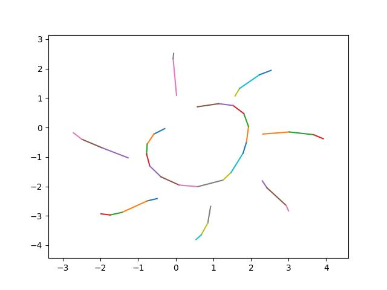

# Sketch RNN using PyTorch

## Abstract
- To be written

## Model architecture
### Draw model

- ```generation()``` function will use output tensor to generate a sketch. 
    - conditional: put dataset into the encoder, and use decoder output. 
    - unconditional: put zero tensor to decoder, and use the output. 

### Classify model

- ```predict()``` function will predict the sketch's category and complete a sketch. 

## Trained examples
We used five categories: bicycle, clock, hand, spider, and sun. 

### Draw model
First, we trained draw models for each category. The result is shown below. 
- bicycle
    
    
    

- clock
    
    
    

- hand

    
    

- spider

    
    

- sun

    
    

### Predict model
Next, we trained general draw model that used all data of five category. Then, we trained FC layer for class classification. 

The used accuracy as the metric. Accuracy varied whenever we train new draw general model. We found the best general model and FC layer for our task, which achieved 82.5% accuracy. 

## Code structure
In ```examples``` directory, there are some pretrained models and sample images thos are shown in this README document. You can use these pretrained model after reading [instruction](#how-to-use) carefully. 

In ```datasets``` directory, there are datasets we used for pretrained models. Refer to [reference] to get more detailed instructions and datasets for other categories. 

Actual implementation of this project is in ```codes``` directory. 
- ```config.py``` defines hyperparameters of training or testing. It also defines model hyperparameters. 
- ```utils.py``` defines utility functions such as making a batch for training, saving images for debugging. 
- ```encoder_rnn.py``` defines encoder LSTM layer, which is used for draw model and predict model. 
- ```decoder_rnn.py``` defines decoder LSTM layer, which is used for draw model and predict model. 
- ```classifier_fc.py``` defines classifier fully-connected layer, which is used for predict model. 
- ```draw_model.py``` defines draw model. 
- ```predict_model.py``` defines predict model. 

Using the code in ```codes``` directory, we implemented some clients that we can run directly. 
- Using ```train_or_test.py```, we can train/test a new draw/predict model. 
- Using ```draw_client.py```, we can use our draw model for unconditional generation of specific category. 
- Using ```predict_client.py```, we can use our predict model for predicting the complete sketch and classifying it. 

## How to use
### Train or Test models
1. Create virtual environment using pipenv or conda. 
    ```
    # pipenv
    pipenv --python 3.7
    pipenv shell

    # conda
    conda create -n sketchrnn python=3.7
    conda activate sketchrnn
    ```
2. Install required packages. 
    ```
    pip install -r requirements.txt
    ```
3. Open [config.py](codes/config.py) and change hyperparameters as you want. Definitions for some hyperparameters are listed below. 
    - ```self.task``` selects Drawing model or Classifying model. 
    - ```self.mode``` selects train or test or client. 
    - ```self.train_output_dir``` points output directory of training. 
        - When training, training result will be saved in this path. (Should not exist)
        - When testing, model in this directory will be used. (Should exist)
    - ```self.test_output_dir``` points output directory of testing. (Should not exist)
    - Name of the other hyperparameters follows the original paper. 
4. Run [train_or_test.py](train_or_test.py)
    ```
    python -m train_or_test
    ```

### Drawing client
1. Set virtual environment and install required packages. 
2. Open [config.py](codes/config.py) and change hyperparameters. 
    - set ```self.task='draw'```
    - set ```self.mode='client'```
    - set ```self.encoder_path_list```, ```self.decoder_path_list``` as encoder/decoder path list to use. 
    - set ```self.classifier_path``` as classifier path to use. 
    - sef ```self.test_output_dir``` points output directory of results. (Should not exist)
3. Run [draw_client.py](draw_client.py)
    ```
    python -m draw_client.py
    ```

### Predicting client
1. Set virtual environment and install required packages. 
2. Open [config.py](codes/config.py) and change hyperparameters. 
    - set ```self.task='predict'```
    - set ```self.mode='client'```
    - set ```self.encoder_path```, ```self.decoder_path```, and ```self.classifier_path``` as encoder/decoder/classifier path to use. 
    - sef ```self.test_output_dir``` points output directory of results. (Should not exist)
3. Run [predict_client.py](predict_client.py)
    ```
    python -m predict_client.py
    ```


## References
- Original paper: https://arxiv.org/abs/1704.03477
- Forked from: https://github.com/alexis-jacq/Pytorch-Sketch-RNN.git
- Datasets: https://github.com/googlecreativelab/quickdraw-dataset
- Hyperparameters: https://github.com/tensorflow/magenta/blob/master/magenta/models/sketch_rnn/README.md
