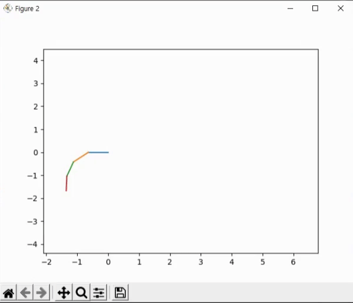

# Sketch RNN using PyTorch

|bicycle|sun|
|---|---|
|||

## Abstract
- To be written

## Model architecture
### Base Encoder-Decoder model

- Consists of encoder and decoder. 
- Encoder encodes the input sequence to a context vector. 
- Decoder decodes the context vector to a sequence. 
- If the model is optimal, output sequence from the decoder will be equal to the input sequence into the encoder. 

### Draw model

- Standalone decoder model
- The decoder is trained in Encoder-Decoder model, then extracted to generate sketches of that category. 
- ```generation()``` function will use context vector to generate a sketch. 
    - conditional: put context vector of a specific sketch into the encoder, and use decoder output. 
    - unconditional: put zero tensor to decoder, and use the output. 

### Classify model

- Consists of general encoder, FC classification layer, and trained decoders. 
- Context vector generated by the general encoder is fed to FC classification layer to classify the input sketch. 
- When the sketch is classified, corresponding decoder generates a sketch from the input sketch. 
- ```predict()``` function will predict the sketch's category and complete a sketch. 

## Train result
We used five categories: bicycle, clock, hand, spider, and sun. 

### Draw model
First, we trained draw models for each category. Train losses are shown below. 

|bicycle|clock|hand|
|---|---|---|
||||

|spider|sun|
|---|---|
|||

### Predict model
Next, we trained general encoder and FC classification layer using all data of five categories. 

Input sequence might be incomplete in some case, so I masked 0% to 50% end of each sequence. I call it ```forget_ratio```, and it is determined randomly between 0% and 50%. 

|loss|accuracy|
|---|---|
|||

After training, I tested the model 10 times, each consists of 10000 incomplete/complete sketches. I could achieve 95.8% test accuracy (0.17% std) The exact test accuracies and test losses are shown below. (from [this](examples/predict/test_results.json))

|Test|Loss|Accuracy|
|---|---|---|
|1|0.12070018004626036|0.9600999766588211|
|2|0.12123540457338094|0.9590999758243561|
|3|0.125164087228477|0.957599977850914|
|4|0.1179955451004207|0.9598999780416488|
|5|0.1277187792211771|0.9560999768972397|
|6|0.12864821162074805|0.9562999755144119|
|7|0.11789190543815493|0.9611999726295472|
|8|0.12493601037189364|0.9567999804019928|
|9|0.13080609628930687|0.9566999781131744|
|10|0.12569178845733403|0.9589999788999557|
|avg|0.12407880083471538|0.9582799770832061|
|std|0.0042270971273982196|0.001716856691856326|

## Examples
### Draw model
- bicycle (see all examples in [here](examples/draw/bicycle))
    |||
    |---|---|
    |||

- clock (see all examples in [here](examples/draw/clock))
    |||
    |---|---|
    |||

- hand (see all examples in [here](examples/draw/hand))
    |||
    |---|---|
    |||

- spider (see all examples in [here](examples/draw/spider))
    |||
    |---|---|
    |||

- sun (see all examples in [here](examples/draw/sun))
    |||
    |---|---|
    |||

### Predict model
- bicycle (see all examples in [here](examples/predict/bicycle))
    - top1: bicycle (0.9986081719398499)
    - top2: spider (0.0008487682789564133)

    |input sketch by user|predicted sketch by predict client|
    |---|---|
    |||
    
- clock (see all examples in [here](examples/predict/clock))
    - top1: clock (0.8678318858146667)
    - top2: hand (0.07294004410505295)
    
    |input sketch by user|predicted sketch by predict client|
    |---|---|
    |||

- hand (see all examples in [here](examples/predict/hand))
    - top1: hand (0.9999791383743286)
    - top2: clock (1.642086135689169e-05)
    
    |input sketch by user|predicted sketch by predict client|
    |---|---|
    |||

- spider (see all examples in [here](examples/predict/spider))
    - top1: spider (0.9865385293960571)
    - top2: sun (0.009002521634101868)

    |input sketch by user|predicted sketch by predict client|
    |---|---|
    |||

- sun (see all examples in [here](examples/predict/sun))
    - top1: sun (0.9043053984642029)
    - top2: spider (0.06436137109994888)
    
    |input sketch by user|predicted sketch by predict client|
    |---|---|
    |||

- out of distribution (see all examples in [here](examples/predict/ood))
    - top1: hand (0.4482879936695099)
    - top2: spider (0.17212322354316711)
    - top3: bicycle (0.16263628005981445)
    - top4: clock (0.15978890657424927)
    - top5: sun (0.0571635439991951)

    |input sketch by user|predicted sketch by predict client|
    |---|---|
    |||

## Code structure
In ```examples``` directory, there are some pretrained models and sample images thos are shown in this README document. You can use these pretrained model after reading [instruction](#how-to-use) carefully. 

In ```datasets``` directory, there are datasets we used for pretrained models. Refer to [reference] to get more detailed instructions and datasets for other categories. 

Actual implementation of this project is in ```codes``` directory. 
- ```config.py``` defines hyperparameters of training or testing. It also defines model hyperparameters. 
- ```utils.py``` defines utility functions such as making a batch for training, saving images for debugging. 
- ```encoder_rnn.py``` defines encoder LSTM layer, which is used for draw model and predict model. 
- ```decoder_rnn.py``` defines decoder LSTM layer, which is used for draw model and predict model. 
- ```classifier_fc.py``` defines classifier fully-connected layer, which is used for predict model. 
- ```draw_model.py``` defines draw model. 
- ```predict_model.py``` defines predict model. 

Using the code in ```codes``` directory, we implemented some clients that we can run directly. 
- Using ```train_or_test.py```, we can train/test a new draw/predict model. 
- Using ```draw_client.py```, we can use our draw model for unconditional generation of specific category. 
- Using ```predict_client_data.py```, we can use our predict model for predicting the complete sketch and classifying it. (using test data, generate incomplete sketches)
- Using ```predict_client_sketch.py```, we can sketch any sketch, and let our predict model to predict the complete sketch and classification. (don't use any data, just draw your sketch!)

## How to use
### Train or Test models
1. Create virtual environment using pipenv or conda. 
    ```
    # pipenv
    pipenv --python 3.7
    pipenv shell

    # conda
    conda create -n sketchrnn python=3.7
    conda activate sketchrnn
    ```
2. Install required packages. Visit [PyTorch Homepage](https://pytorch.org/get-started/locally/) to install proper version of torch. 
    ```
    pip install -r requirements.txt
    ```
3. Open [config.py](codes/config.py) and change hyperparameters as you want. Definitions for some hyperparameters are listed below. 
    - ```self.task``` selects Drawing model or Classifying model. 
    - ```self.mode``` selects train or test or client. 
    - ```self.train_output_dir``` points output directory of training. 
        - When training, training result will be saved in this path. (Should not exist)
        - When testing, model in this directory will be used. (Should exist)
    - ```self.test_output_dir``` points output directory of testing. (Should not exist)
    - set ```self.categories``` and ```self.data_path_list``` as you want. (Their length should be equal)
    - ```self.max_epoch``` as you want. (recommend 10001 or 40001 for draw model and 10001 for predict model)
    - If you train predict model, set ```self.forget_ratio``` as you want. 
    - Name of the other hyperparameters follows the original paper. 
4. Run [train_or_test.py](train_or_test.py)
    ```
    python -m train_or_test
    ```

### Drawing client
1. Set virtual environment and install required packages. Visit [PyTorch Homepage](https://pytorch.org/get-started/locally/) to install proper version of torch. 
2. Open [config.py](codes/config.py) and change hyperparameters. 
    - set ```self.task='draw'```
    - set ```self.mode='client'```
    - set ```self.train_output_dir``` as ```''```. 
    - set ```self.test_output_dir``` points output directory of results. (Should not exist)
    - set ```self.categories``` and ```self.data_path_list``` to have 5 items as default. 
    - set ```self.encoder_path_list```, ```self.decoder_path_list``` to have 5 items as default. 
3. Run [draw_client.py](draw_client.py)
    ```
    python -m draw_client.py
    ```

### Predicting client
1. Set virtual environment and install required packages. 
2. Open [config.py](codes/config.py) and change hyperparameters. 
    - set ```self.task='predict'```
    - set ```self.mode='client'```
    - set ```self.train_output_dir``` as ```''```
    - set ```self.test_output_dir``` points output directory of results. (Should not exist)
    - set ```self.categories``` and ```self.data_path_list``` to have 5 items as default. 
    - set ```self.encoder_path_list```, ```self.decoder_path_list``` to have 5 items as default. 
    - set ```self.encoder_path```, ```self.decoder_path_list```, and ```self.classifier_path``` as default. 
    - set ```self.forget_ratio```. 
        - if you want to run ```predict_client_data.py```, set it to 0.5. 
        - if you want to run ```predict_client_sketch.py```, set it to 0.0. 
    
3. Run [predict_client_data.py](predict_client_data.py) or [predict_client_sketch.py](predict_client_sketch.py)
    ```
    # to run with test data
    python -m predict_client_data.py

    # to run with your sketches
    python -m predict_client_sketch.py
    ```

## References
- Original paper: https://arxiv.org/abs/1704.03477
- Forked from: https://github.com/alexis-jacq/Pytorch-Sketch-RNN.git
- Datasets: https://github.com/googlecreativelab/quickdraw-dataset
- Out-of-distribution: https://arxiv.org/pdf/1503.02531.pdf
- Hyperparameters: https://github.com/tensorflow/magenta/blob/master/magenta/models/sketch_rnn/README.md
